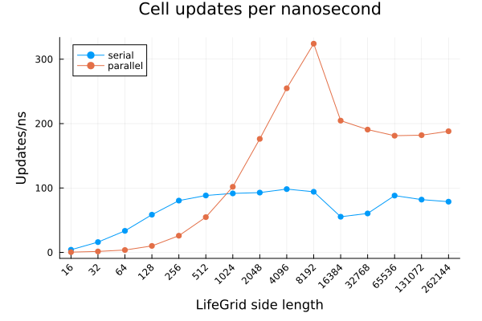

# LifeGame.jl

`LifeGame.jl` is a simple, fast, threaded [Conway's Game of Life](https://en.wikipedia.org/wiki/Conway%27s_Game_of_Life) simulator inspired by [exrok's Rust implementation](https://github.com/exrok/game_of_life). It is optimized for large, dense, high-entropy grids.

Only fixed boundary conditions--considering all cells outside of the finite grid to be dead--are available [for now](#future-work).

[Here](https://youtu.be/DehyzMiwDwY) is a [presentation](https://docs.google.com/presentation/d/1D52NkO1bAx7DJG9WCElswsvsZ4wDRSYU_7lufQqEku8/edit?usp=sharing) that I gave for a friend's students which explains some of the optimzation choices made when creating `LifeGame.jl`.

## Simple

`LifeGame.jl` is easy to use:

```julia
# Install and use
using Pkg
Pkg.add("https://github.com/mjg0/LifeGame.jl")
using LifeGrid, Plots

# Create a LifeGrid
lg = LifeGrid(35, 35)

# Put a pulsar in the middle
insert!(lg, 11, 11, LifePatterns.pulsar)

# Put gliders at each corner, each closer to the pulsar by one cell
insert!(lg,  1,  1, LifePatterns.glider)
insert!(lg, 32,  1, LifePatterns.glider[end:-1:begin,:])
insert!(lg,  2, 32, LifePatterns.glider[:,end:-1:begin])
insert!(lg, 31, 32, LifePatterns.glider[end:-1:begin,end:-1:begin])

# Animate the resultant simulation
@gif for _ in 1:300
    heatmap(lg, size=(400, 400), cbar=false, ticks=false, margin=(-2, :mm))
    step!(lg)
end
```


**<details><summary>More</summary>**

You only really need to know 2 methods to use `LifeGame.jl`:

- The constructor:
  - `LifeGame(m, n)`: create an `m×n` grid devoid of life.
  - `LifeGame(grid)`: create a grid from `grid`, where non-zero or true cells are alive.
- `step!(lifegrid)`: update `lifegrid` once.

`LifeGrid`s are `AbstractArray`s, so you can index one as you would expect:

```julia
mygrid = LifeGrid([0 1 1 0
                   1 0 0 1
                   0 1 1 0])
mygrid[1, 1] # false
mygrid[1, 2] # true
mygrid[1, 3] = false # OK
mygrid[1, 4] = 1 # also OK
```

If you plan on adding many of the same pattern into a `LifeGrid`, it is most efficient to create a `LifePattern` once then `insert!` it multiple times:

```julia
mygrid = LifeGrid(1000, 2000)
mypattern = LifePattern([1 0 1 0 1 1 1
                         1 1 1 0 0 1 0
                         1 0 1 0 1 1 1])
for _ in 1:100
    I = CartesianIndex((rand(100:900), rand(100:1900)))
    insert!(mygrid, I, mypattern)
end
```

Some commonly used patterns are provided in the `LifePatterns` module.

</details>


## Fast

`LifeGame.jl` is fast, achieving many tens of billions of cell updates per second on modern hardware. The plot below shows how many cells per nanosecond were updated on dense square grids of various sizes with 4 Julia threads on a laptop with an AMD 7640U:



**<details><summary>More</summary>**

Such performance is attained by packing 62 cells into 64-bit operands and updating them simultaneously using bitwise operations; see the extended help for `LifeGrid`, `LifeGame.updatedcluster`, and `LifeGame.stepraw!` for algorithm details.

The plot above was generated thus:

```julia
using LifeGame, BenchmarkTools, Plots

# Side lengths to test
sidelengths = 2 .^(4:18)

# Test in serial and parallel
serialresults, parallelresults = (begin
    # Warm up the CPU for 1 minute
    t = time()
    while time()-t < 60
        step!(LifeGrid(1000, 1000), parallel=parallel)
    end
    # Get results for every side length
    [begin
        # Free up memory
        GC.gc()
        # Create the grid
        lg = LifeGrid(sidelength, sidelength)
        # Get and return results
        chunklength = parallel ? min(cld(sidelength, Threads.nthreads()), 64) : 64
        result = @benchmark step!($lg, parallel=$parallel, chunklength=$chunklength)
        sidelength^2/mean(result.times)
    end for sidelength in sidelengths]
end for parallel in (false, true))

# Plot and save results
plot(sidelengths, serialresults, title="Cell updates per nanosecond",
     label="serial", xlabel="LifeGrid side length", ylabel="Updates/ns",
     legend_position=:topleft, marker=:circle, markerstrokewidth=0,
     xscale=:log10, xticks=(sidelengths, sidelengths), xrotation=45,
     margin=(5, :mm), size=(600, 400))
plot!(sidelengths, parallelresults, label="parallel", marker=:circle, markerstrokewidth=0)
png("benchmark-results.png")
```

</details>


## Future Work

- Different boundary conditions would be useful:
  - Neumann
  - Wrapped

- Allowing for infinite grids by dynamically creating extra grids when cells cross into unmapped regions would be interesting, but [Hashlife](https://en.wikipedia.org/wiki/Hashlife) is probably a better choice for such use cases.

- This style of implementation is amenable to GPU acceleration.

- A sparse algorithm that actually works could be worthwhile

**Issues and pull requests are welcome!**
