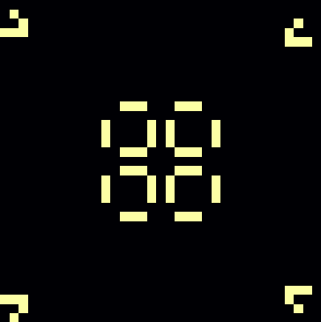
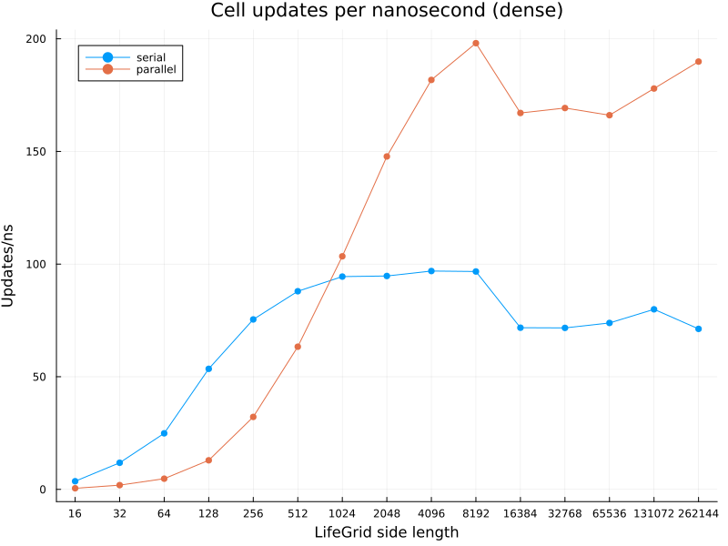
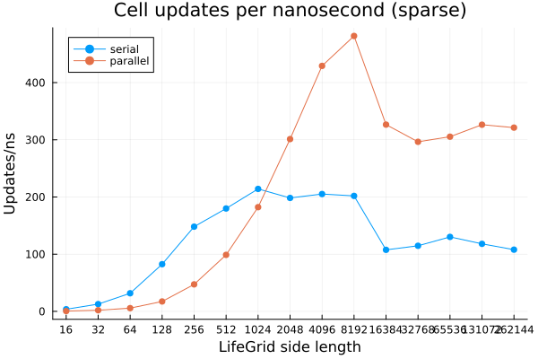

# LifeGame.jl

`LifeGame.jl` is a simple, fast, threaded [Conway's Game of Life](https://en.wikipedia.org/wiki/Conway%27s_Game_of_Life) simulator inspired by [exrok's Rust implementation](https://github.com/exrok/game_of_life). It is optimized for large, dense, high-entropy grids.

Only fixed boundary conditions--considering all cells outside of the finite grid to be dead--are available [for now](#future-work).

## Simple

`LifeGame.jl` is easy to use:

```julia
# Install and use
using Pkg
Pkg.add("https://github.com/mjg0/LifeGame.jl")
using LifeGrid, Plots

# Create a LifeGrid
lg = LifeGrid(35, 35)

# Put a pulsar in the middle
insert!(lg, 11, 11, LifePatterns.pulsar)

# Put gliders at each corner, each closer to the pulsar by one cell
insert!(lg,  1,  1, LifePatterns.glider)
insert!(lg, 32,  1, LifePatterns.glider[end:-1:begin,:])
insert!(lg,  2, 32, LifePatterns.glider[:,end:-1:begin])
insert!(lg, 31, 32, LifePatterns.glider[end:-1:begin,end:-1:begin])

# Animate the resultant simulation
@gif for _ in 1:300
    heatmap(lg, size=(400, 400), cbar=false, ticks=false, margin=(-2, :mm))
    step!(lg)
end
```



**<details><summary>More</summary>**

You only really need to know 2 methods to use `LifeGame.jl`:

- The constructor:
  - `LifeGame(m, n)`: create an `m×n` grid devoid of life.
  - `LifeGame(grid)`: create a grid from `grid`, where non-zero or true cells are alive.
- `step!(lifegrid)`: update `lifegrid` once.

`LifeGrid`s are `AbstractArray`s, so you can index one as you would expect:

```julia
mygrid = LifeGrid([0 1 1 0
                   1 0 0 1
                   0 1 1 0])
mygrid[1, 1] # false
mygrid[1, 2] # true
mygrid[1, 3] = false # OK
mygrid[1, 4] = 1 # also OK
```

If you plan on adding many of the same pattern into a `LifeGrid`, it is most efficient to create a `LifePattern` once then `insert!` it multiple times:

```julia
mygrid = LifeGrid(1000, 2000)
mypattern = LifePattern([1 0 1 0 1 1 1
                         1 1 1 0 0 1 0
                         1 0 1 0 1 1 1])
for _ in 1:100
    I = CartesianIndex((rand(100:900), rand(100:1900)))
    insert!(mygrid, I, mypattern)
end
```

Some commonly used patterns are provided in the `LifePatterns` module.

</details>


## Fast

`LifeGame.jl` is fast, achieving many tens of billions of cell updates per second on modern hardware. The plot below shows how many cells per nanosecond were updated on dense square grids of various sizes with 4 Julia threads on a laptop with an AMD 7640U:



**<details><summary>More</summary>**

Sparse grids (where about 90% of `128×62`-cell "chunks" of the grid are devoid of life) can be updated even faster:



Such performance is attained by packing 62 cells into 64-bit operands and updating them simultaneously using bitwise operations; see the extended help for `LifeGrid`, `LifeGame.updatedcluster`, and `LifeGame.stepraw!` for algorithm details.

The plots above were generated thus:

```julia
using LifeGame, BenchmarkTools, DataFrames, Plots

# DataFrame to hold benchmarking data
benchmarkdata = DataFrame(density=Symbol[], parallel=Bool[], sidelength=Int[],
                          meantime=Float64[])

# Test both serial and parallel speeds
for parallel in (false, true)
    # Warm up the CPU
    time1 = time()
    while time()-time1 < 60 # Give it a minute to warm up
        step!(LifeGrid(rand(Bool, 1000, 1000)), parallel=parallel)
    end

    # Run both sparse and dense benchmarks for many sizes
    for sidelen in 2 .^(4:18)
        # Force parallelism even when the default is to avoid it at small sizes
        chunklen = parallel ? min(128, cld(sidelen, Threads.nthreads())) : 128

        # Construct and sparsely fill the grid
        lg = LifeGrid(sidelen, sidelen)
        for i in 1:128*62*10:length(lg) # this will leave about 90% of chunks untouched
            lg[i:i+2] .= true # insert a blinker
        end

        # Get sparse results
        sparse_results = @benchmark step!($lg, parallel=$parallel, chunklength=$chunklen)
        push!(benchmarkdata, (:sparse, parallel, sidelen, mean(sparse_results.times)))

        # Densify the grid a bit; most chunks will now have several living cells
        i = rand(1:chunklen)
        while i < length(lg)-2
            lg[i:i+2] .= true # insert a blinker
            i += chunklen÷2 + rand(1:chunklen)
        end

        # Get dense results
        dense_results = @benchmark step!($lg, parallel=$parallel, chunklength=$chunklen)
        push!(benchmarkdata, (:dense, parallel, sidelen, mean(dense_results.times)))
    end
end

# Determine operations per nanosecond for each permutation
lengths = subset(benchmarkdata, :density=>d->d.==:dense, :parallel=>p->p.==true).sidelength
dense_serial_ops, sparse_serial_ops, dense_parallel_ops, sparse_parallel_ops = (
    lengths.^2 ./ subset(benchmarkdata, :density=>d->d.==density,
                                        :parallel=>p->p.==parallel).meantime
    for (density, parallel) in ((:dense,  false),
                                (:sparse, false),
                                (:dense,  true ),
                                (:sparse, true ))
)

# Plot timing data
for (density, serial_ops, parallel_ops) in (("dense", dense_serial_ops, dense_parallel_ops),
                                            ("sparse", sparse_serial_ops, sparse_parallel_ops))
    plot( lengths, serial_ops, title="Cell updates per nanosecond ($density)",
          label="serial", xlabel="LifeGrid side length", ylabel="Updates/ns",
          legend_position=:topleft, marker=:circle, markerstrokewidth=0,
          xscale=:log10, xticks=(lengths, lengths), xrotation=45,
          margin=(5, :mm), size=(600, 400))
    plot!(lengths, parallel_ops, label="parallel", marker=:circle, markerstrokewidth=0)
    png("benchmark-results-$density.png")
end
```

</details>


## Future Work

- Different boundary conditions would be useful:
  - Neumann
  - Wrapped

- Allowing for infinite grids by dynamically creating extra grids when cells cross into unmapped regions would be interesting, but [Hashlife](https://en.wikipedia.org/wiki/Hashlife) is probably a better choice for such use cases.

- This style of implementation is amenable to GPU acceleration.

**Issues and pull requests are welcome!**
