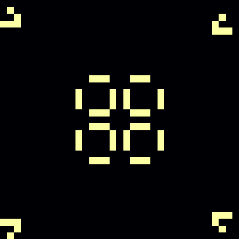
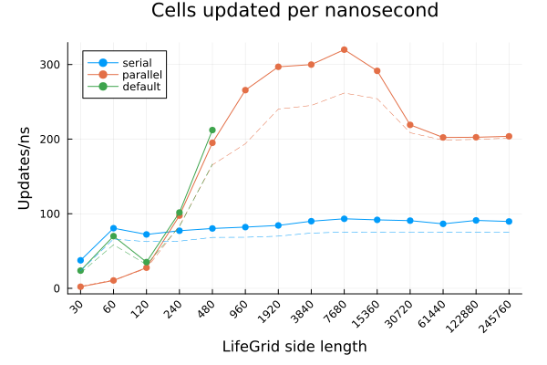
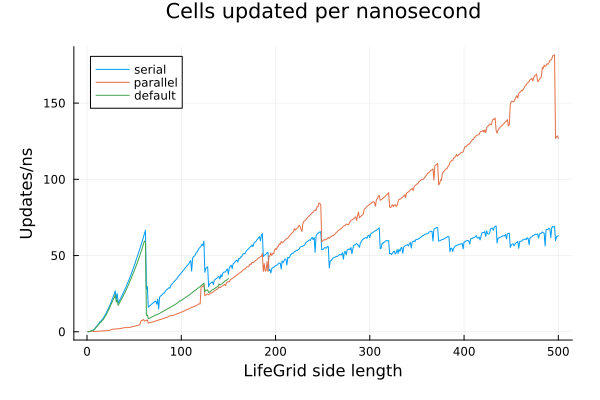

# LifeGame.jl

`LifeGame.jl` is a simple, fast, threaded simulator for cellular automata like [Conway's Game of Life](https://en.wikipedia.org/wiki/Conway%27s_Game_of_Life). It is optimized for large, dense, high-entropy grids. Currently, only fixed boundary conditions are supported--cells outside the finite grid are treated as dead.

[Here](https://youtu.be/DehyzMiwDwY) is a [presentation](https://docs.google.com/presentation/d/1D52NkO1bAx7DJG9WCElswsvsZ4wDRSYU_7lufQqEku8/edit?usp=sharing) that I gave for a friend's students to explain some of the optimization choices behind `LifeGame.jl`.

## Simple

`LifeGame.jl` is easy to use:

```julia
# Install and use
using Pkg
Pkg.add("https://github.com/mjg0/LifeGame.jl")
using LifeGrid, Plots

# Create a LifeGrid
lg = LifeGrid(35, 35)

# Put a pulsar in the middle
insert!(lg, 11, 11, LifePatterns.pulsar)

# Put gliders at each corner, each closer to the pulsar by one cell
insert!(lg,  1,  1, LifePatterns.glider1)
insert!(lg, 32,  1, LifePatterns.glider6)
insert!(lg,  2, 32, LifePatterns.glider2)
insert!(lg, 31, 32, LifePatterns.glider5)

# Animate the resultant simulation
@gif for _ in 1:300
    heatmap(lg, size=(400, 400), cbar=false, ticks=false, margin=(-2, :mm))
    step!(lg)
end
```



**<details><summary>More</summary>**

You only need to know 2 methods to use `LifeGame.jl`:

- The constructor:
  - `LifeGrid(m, n; rule="B3/S23")`: create an `m×n` grid devoid of life.
  - `LifeGrid(grid::AbstractMatrix; rule="B3/S23")`: create a grid from `grid`, where non-zero or true cells are alive.
- `step!(lg)`: update the `LifeGrid` `lg` once.

`LifeGrid`s are `AbstractArray`s, so you can index one as you would expect:

```julia
lg = LifeGrid([0 1 1 0
               1 0 0 1
               0 1 1 0])
lg[1, 1] # false
lg[1, 2] # true
lg[1, 3] = false # OK
lg[1, 4] = 1 # also OK
```

Rules for the simulation's evolution are formatted as `Bm.../Sn...`, where `m...` and `n...` are non-delimited lists of neighbor sums for which cells are born or survive, respectively. A cell's neighbors are the 8 surrounding cells: up, down, left, right, and the four diagonals, so the sum can be anywhere from 0 to 8. As an example, a grid for simulating [highlife](https://en.wikipedia.org/wiki/Highlife_%28cellular_automaton%29) (for which 2 or 3 living neighbors lead to cell survival and 3 or 6 living neighbors lead to cell birth) can be created like this:

```julia
highlifegrid = LifeGrid(200, 300; rule="B36/S23")
```

The default `rule` is Conway's Game of Life (`B3/S23`).

If you plan on inserting the same pattern many times into a `LifeGrid`, it is most efficient to create a `LifePattern` once then `insert!` it multiple times:

```julia
lg = LifeGrid(1000, 2000)
pattern = LifePattern([1 0 1 0 1 1 1
                       1 1 1 0 0 1 0
                       1 0 1 0 1 1 1])
for _ in 1:100
    I = CartesianIndex((rand(100:900), rand(100:1900)))
    insert!(lg, I, pattern)
end
```

Some commonly used patterns are provided in the `LifePatterns` module.

</details>


## Fast

`LifeGame.jl` is fast, achieving many tens of billions of cell updates per second on any reasonable modern hardware, and exceeding a trillion on fast server chips. The plot below shows the number of cells updated per nanosecond on dense square grids of various sizes (all with rule `B3/S23`) by `step!` with 1 and 4 Julia threads on a laptop with an AMD 7640U:



The prominent lines correspond to the default `dense` algorithm, the dashed lines to the `sparse` algorithm. This chunkwise sparse algorithm is more efficient for grids with inactive regions, and can be called with `step!(lg, sparse[, serial|parallel])`.

`step!` usually makes good choices about whether to run with multiple threads automatically, but for grids between 62 and a few hundred cells wide it's worth testing whether your specific case benefits from threading. Use `step!(lg, serial)` to run the serial algorithm, or `step!(lg, parallel)` for the parallel algorithm.

**<details><summary>More</summary>**

`LifeGame.jl`'s high performance is attained by packing many cells into unsigned integer operands (usually 62 cells in 64 bits) and updating them simultaneously using bitwise operations. These operands, which represent portions of rows, are grouped together to form blocks (usually 64 cells tall) that are handled with code amenable to compiler unrolling and vectorization. See the extended help for `LifeGrid`, `LifeGame.updatedcluster`, and `LifeGame.updatecolumn!` for implementation details.

Per-cell update performance is maximized when a grid's dimensions align with its block size. The difference is pronounced at small sizes:



`step!` will be limited by memory bandwidth on most modern hardware; you can see this in the [first graph](#fast), which shows that grids larger than the laptop's CPU cache are limited to around 200 cell updates per nanosecond (which remains the ceiling regardless of thread count). Memory is used very efficiently: a 100,000x100,000 `LifeGrid`, which holds 1.25 GB of information, fits in 1.38 GB of memory. Almost all of a `LifeGrid` is read from and written to exactly once per `step!`.

The plots in this section were generated with [`examples/benchmark-plots.jl`](examples/benchmark-plots.jl).

</details>


## Future Work

- Different boundary conditions would be useful:
  - Neumann
  - Wrapped

- Allowing for infinite grids by dynamically creating extra grids when cells cross into unmapped regions would be interesting, but [Hashlife](https://en.wikipedia.org/wiki/Hashlife) is probably a better choice for such use cases.

- This style of implementation is amenable to GPU acceleration.

**Issues and pull requests are welcome!**
